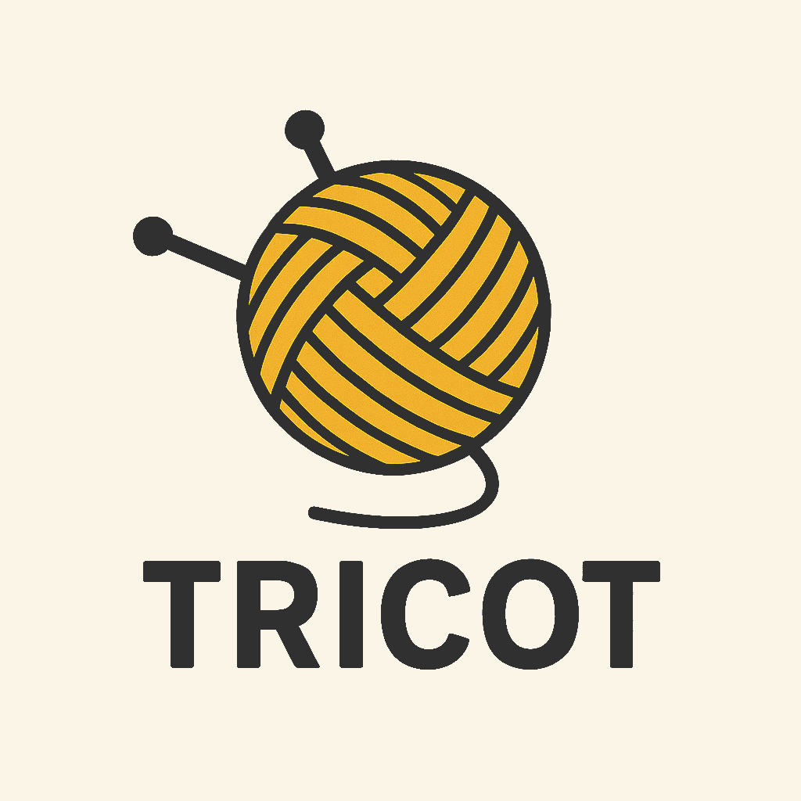

# tricot-lang

<p align="center">
  
</p>

This language is based on the ECS pattern and uses a syntax close to that of Rust and Gleam

## Code example

```rust
comp Position(x: Int, y: Int)
comp Velocity(dx: Int, dy: Int)

sys move_entities(position: mut Position, velocity: Velocity) {
    position.x += velocity.dx
    position.y += velocity.dy

    print(position.x)
    print(position.y)
}

sys entity_spawner() {
    let id = spawn {
        Position(0, 0),
        Velocity(1, 1)
    }
}

schedule {
    entity_spawner,
    move_entities
}
```
